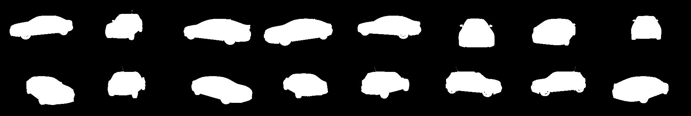

Here we are using UNET for image segmentation

## Data Generation

We are using 3 channel image resized to 160*240. 

### Architecture 

### Advantages UNET provides 
- Excellent segmentation accuracy: UNET has demonstrated impressive performance in semantic segmentation tasks, achieving state-of-the-art results in several benchmarks. It can effectively capture fine-grained details and accurately delineate object boundaries.

- U-shaped architecture: UNET's U-shaped architecture allows for both localization and contextual information extraction. The contracting path captures the context by downsampling the input image, while the expanding path combines the low-level features with the high-resolution features to generate precise segmentations.

- Skip connections: Skip connections enable the merging of low-level features from the contracting path with high-level features from the expanding path. This helps in preserving spatial information and assists in the precise localization of objects, even at different scales.

- Reduced parameter count: UNET uses a relatively compact network structure compared to other architectures, resulting in a reduced number of parameters. This reduces the risk of overfitting and allows for faster training and inference times.

- Data efficiency: UNET can be trained effectively with limited amounts of annotated data, making it suitable for scenarios where large-scale annotated datasets may not be available. By utilizing data augmentation techniques, the model can generalize well and provide accurate segmentations even with limited training samples.

- Versatility: While UNET was initially developed for biomedical image segmentation, its architecture has been successfully applied to various other tasks, such as cell tracking, organ segmentation, and road segmentation in satellite imagery. Its adaptability makes it a versatile choice for different segmentation challenges.

- Interpretability: Due to its U-shaped architecture and skip connections, UNET provides interpretable results. The network produces dense predictions that are pixel-wise, allowing for a detailed understanding of the segmentation map. This can be beneficial for analyzing and validating the model's performance.

- Availability of pre-trained models: Pre-trained UNET models are available, trained on large-scale datasets such as ImageNet or medical imaging datasets. These pre-trained models can be fine-tuned on specific tasks with smaller datasets, providing a starting point and accelerating development.

### Results 

Accuracy = 99.70 on 48 Validation Images 

